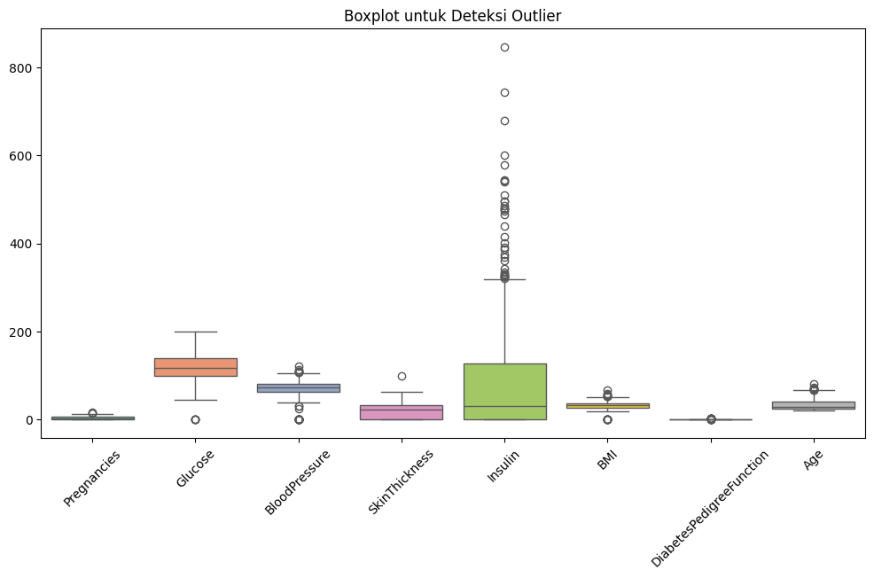
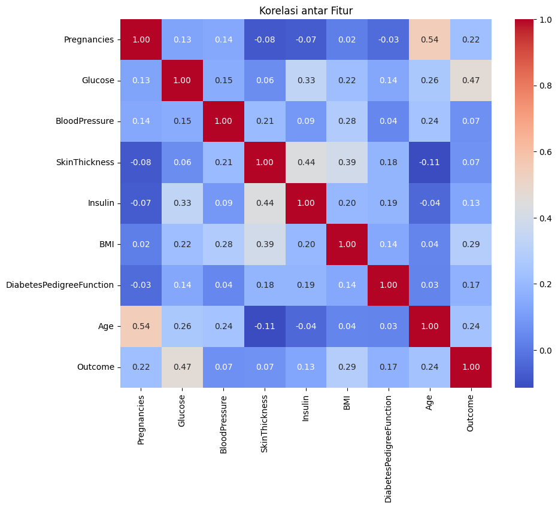
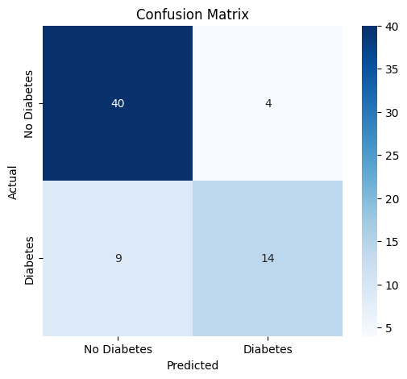
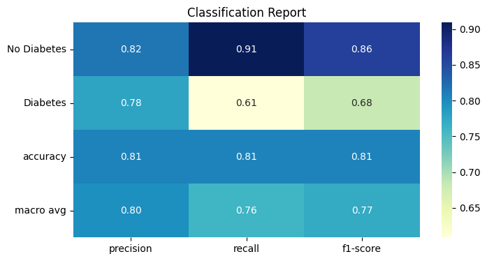

# Laporan Proyek Machine Learning - Nama Anda

## Domain Proyek

Diabetes mellitus merupakan salah satu penyakit kronis dengan prevalensi yang terus meningkat di seluruh dunia. Berdasarkan laporan terbaru dari International Diabetes Federation (IDF), diperkirakan sebanyak 589 juta orang dewasa (usia 20–79 tahun) hidup dengan diabetes pada tahun 2024, dan angka ini diproyeksikan meningkat menjadi 853 juta pada tahun 2050 [1]. Sekitar 43% penderita diabetes dewasa tidak terdiagnosis, yang menyebabkan keterlambatan penanganan dan meningkatkan risiko komplikasi serius seperti penyakit jantung, gagal ginjal, dan kebutaan [1].
Salah satu tantangan besar dalam upaya pengendalian diabetes adalah deteksi dini, khususnya untuk tipe 2 yang berkembang secara perlahan dan seringkali tanpa gejala yang jelas. Pendekatan konvensional dalam diagnosis sering membutuhkan pemeriksaan laboratorium dan kunjungan medis berkala, yang mungkin tidak selalu dapat diakses oleh masyarakat luas, terutama di negara berkembang.
Di sinilah pendekatan machine learning (ML) berperan sebagai solusi modern. Machine learning memungkinkan sistem untuk mempelajari pola dari data medis historis — seperti kadar glukosa darah, tekanan darah, indeks massa tubuh (BMI), usia, dan jumlah kehamilan — dan kemudian digunakan untuk memprediksi risiko seseorang terkena diabetes secara otomatis dan efisien. Algoritma klasifikasi dalam ML terbukti memiliki akurasi yang tinggi dalam mengidentifikasi pasien berisiko tanpa intervensi manual secara langsung [2].
Salah satu dataset yang umum digunakan adalah Pima Indians Diabetes Dataset (PIDD), yang berisi 768 data kuantitatif dari wanita keturunan Pima Indian di AS [3]. Dataset ini telah menjadi benchmark dalam riset kesehatan prediktif, digunakan untuk melatih dan menguji berbagai model machine learning seperti Logistic Regression, Random Forest, dan Neural Network [4].
Mengadopsi pendekatan ML tidak hanya memungkinkan efisiensi dalam proses skrining, tetapi juga dapat diterapkan sebagai sistem peringatan dini (early warning system) dalam platform digital seperti aplikasi kesehatan masyarakat. Pendekatan ini sangat relevan dan strategis di era transformasi digital layanan kesehatan.

Referensi :

[1] International Diabetes Federation, “IDF Diabetes Atlas, 2024 Update,” [Online]. Available: https://diabetesatlas.org/data-by-location/global/. [Accessed: 19-May-2025].

[2] E. Alpaydin, Introduction to Machine Learning, 4th ed., Cambridge, MA: MIT Press, 2020.

[3] UCI Machine Learning Repository, “Pima Indians Diabetes Database,” [Online]. Available: https://www.kaggle.com/datasets/uciml/pima-indians-diabetes-database. [Accessed: 19-May-2025].

[4] H. Aslam et al., “Comparative Analysis of Machine Learning Techniques for the Prediction of Diabetes,” Scientific Reports, vol. 13, no. 1, pp. 1–10, Jan. 2023. [Online]. Available: https://www.nature.com/articles/s41598-023-27591-9.

## Business Understanding

### Problem Statements

Bedasarkan latar belakang di atas, maka dapat disimpulkan bahwa masalah dalam pengembangan ini adalah:

1. Tingkat keterlambatan diagnosis diabetes masih tinggi, terutama pada penderita diabetes tipe 2 yang sering tidak menunjukkan gejala awal secara jelas. Akibatnya, banyak penderita baru menyadari kondisinya setelah terjadi komplikasi serius yang memerlukan penanganan lebih kompleks dan mahal.

2. Proses diagnosis konvensional membutuhkan fasilitas medis dan tenaga kesehatan, yang belum tentu mudah diakses oleh semua lapisan masyarakat, terutama di daerah terpencil atau negara dengan keterbatasan sumber daya.

3. Belum tersedia sistem deteksi dini yang bersifat otomatis, efisien, dan berbasis data kuantitatif yang dapat membantu dalam proses skrining awal risiko diabetes secara cepat dan akurat.

4. Meskipun telah tersedia data medis historis seperti kadar glukosa darah, tekanan darah, BMI, dan usia pasien, data tersebut belum dimanfaatkan secara optimal melalui teknologi machine learning untuk mengidentifikasi pola risiko diabetes secara prediktif.

5. Diperlukan pengembangan model klasifikasi berbasis machine learning yang dapat memprediksi risiko diabetes secara akurat dan dapat diintegrasikan ke dalam sistem digital kesehatan sebagai alat bantu skrining awal.

### Goals

Tujuan dari proyek ini adalah :

1. Mengembangkan model prediksi risiko diabetes menggunakan pendekatan machine learning, khususnya metode klasifikasi, berdasarkan data kuantitatif seperti kadar glukosa darah, tekanan darah, BMI, usia, dan parameter medis lainnya.

2. Meningkatkan deteksi dini terhadap potensi diabetes tipe 2, dengan memanfaatkan data historis dan algoritma yang dapat mengenali pola-pola risiko secara otomatis tanpa perlu intervensi medis langsung.

3. Menyediakan solusi skrining yang efisien, akurat, dan dapat digunakan secara luas, terutama bagi masyarakat yang memiliki akses terbatas terhadap fasilitas medis.

4. Memanfaatkan dan mengoptimalkan dataset medis (seperti Pima Indians Diabetes Dataset) sebagai dasar pengembangan dan evaluasi model prediktif diabetes berbasis machine learning.

5. Menguji dan mengevaluasi performa berbagai algoritma klasifikasi (misalnya: Logistic Regression, Decision Tree, Random Forest, Neural Network) untuk menentukan model terbaik yang dapat diintegrasikan dalam sistem pendukung keputusan di bidang kesehatan.

Semua poin di atas harus diuraikan dengan jelas. Anda bebas menuliskan berapa pernyataan masalah dan juga goals yang diinginkan.

## Data Understanding

Dataset yang digunakan dalam proyek ini adalah Pima Indians Diabetes Database, yang berasal dari UCI Machine Learning Repository dan juga tersedia di Kaggle. Dataset ini dikumpulkan oleh National Institute of Diabetes and Digestive and Kidney Diseases (NIDDK) dan difokuskan pada populasi wanita keturunan Pima Indian di Arizona, Amerika Serikat, yang berusia 21 tahun ke atas. Dataset ini memiliki 768 baris dengan 9 variabel yang salah satunya adalah variabel target. [Sumber : Pima Indians Diabetes Database](https://www.kaggle.com/datasets/uciml/pima-indians-diabetes-database/data)

Selanjutnya uraikanlah seluruh variabel atau fitur pada data. Sebagai contoh:  

### Variabel-variabel pada Pima Indians Diabetes Database ini adalah sebagai berikut:
- Pregnancies : Jumlah kehamilan
- Glucose : Konsentrasi glukosa plasma (glucose level) 2 jam dalam tes toleransi glukosa
- BloodPressure : Tekanan darah diastolik (mm Hg)
- SkinThickness : Ketebalan lipatan kulit trisep (mm)
- Insulin : Kadar insulin serum 2 jam (mu U/ml)
- BMI : Indeks massa tubuh (kg/m²)
- DiabetesPedigreeFunction : Fungsi riwayat keluarga diabetes (probabilistik)
- Age : Usia pasien (dalam tahun)
- Outcome : Label target: 0 = tidak diabetes, 1 = diabetes

### Nilai 0 atau Null pada kolom medis (Glucose, BloodPressure, SkinThickness, Insulin, dan BMI).
- Glucose : 5
- BloodPressure : 35
- SkinThickness : 227
- Insulin : 374
- BMI : 11

**Catatan : Nilai 0 pada kolom medis dianggap sebagai error karena nilai tersebut tidak mungkin terjadi pada fitur-fitur medis**

### Distribusi Fitur

Berdasarkan analisis distribusi fitur, diketahui bahwa sebagian besar pasien memiliki riwayat kehamilan antara 0 hingga 3 kali, dengan jumlah yang jauh lebih sedikit pada kehamilan lebih dari 10, menunjukkan distribusi positif skew pada fitur Pregnancies. Fitur Glucose memiliki distribusi yang mendekati normal namun sedikit skew ke kanan, dengan rentang umum antara 90 hingga 150; meskipun demikian, terdapat nilai 0 yang secara medis tidak masuk akal, yang menunjukkan kemungkinan data hilang atau tidak terukur. BloodPressure memperlihatkan distribusi hampir normal, dengan mayoritas pasien memiliki tekanan darah di kisaran 60–80 mmHg, namun juga ditemukan nilai 0 yang perlu diatasi dalam tahap praproses data. Distribusi SkinThickness sangat skew ke kanan dengan banyak nilai 0, mengindikasikan bahwa pengukuran ini mungkin tidak dilakukan pada banyak pasien. Fitur Insulin memiliki distribusi yang sangat tidak merata, dengan lebih dari separuh data menunjukkan nilai 0, yang mengindikasikan kemungkinan besar data yang hilang. Pada fitur BMI, mayoritas pasien memiliki indeks massa tubuh antara 30–40, yang termasuk kategori overweight atau obesitas, dan distribusinya mendekati normal tetapi tetap mengandung beberapa nilai 0 yang tidak logis. Fitur DiabetesPedigreeFunction menunjukkan skew ke kanan, dengan sebagian besar pasien memiliki skor risiko keturunan rendah (< 0.5), sementara hanya sedikit yang menunjukkan risiko genetik tinggi. Age juga menunjukkan skew ke kanan, dengan dominasi usia pasien antara 20 hingga 40 tahun, dan hanya sedikit pasien yang berusia lebih dari 60 tahun. Sementara itu, fitur Outcome sebagai variabel target bersifat biner dengan proporsi yang tidak seimbang, yaitu sekitar 65% pasien tidak menderita diabetes (label 0) dan 35% menderita diabetes (label 1), yang menandakan adanya klasifikasi imbalance yang perlu ditangani pada tahap modeling.

### Boxplot 

Berdasarkan boxplot yang ditampilkan, dapat dilihat bahwa sebagian besar fitur dalam dataset Pima Indians Diabetes mengandung outlier — yaitu nilai-nilai ekstrem yang berada di luar batas interkuartil (IQR). Fitur Insulin menunjukkan jumlah outlier terbanyak, dengan nilai-nilai yang sangat tinggi bahkan melebihi angka 800. Hal ini menunjukkan bahwa distribusi data insulin sangat tidak merata dan mengandung banyak nilai ekstrem, sehingga memerlukan penanganan khusus seperti imputasi atau transformasi. Fitur SkinThickness, BMI, dan DiabetesPedigreeFunction juga memperlihatkan beberapa titik outlier, meskipun tidak sebanyak insulin. Fitur Glucose dan BloodPressure memiliki beberapa outlier yang lebih terbatas namun tetap penting diperhatikan, terutama karena keduanya adalah indikator medis utama dalam diagnosis diabetes. Sementara itu, fitur Pregnancies dan Age juga memiliki outlier, namun masih dalam rentang yang relatif wajar karena variasi biologis antar individu. Secara keseluruhan, visualisasi ini menegaskan bahwa sebelum membangun model machine learning, perlu dilakukan penanganan outlier, baik dengan trimming, winsorizing, maupun teknik robust scaling, untuk memastikan bahwa model tidak bias terhadap nilai-nilai ekstrem yang dapat merusak generalisasi.

### Korelasi Antar Fitur

Diagram di atas menunjukkan heatmap korelasi antar fitur dalam dataset Pima Indians Diabetes. Korelasi diukur menggunakan koefisien Pearson, dengan rentang antara -1 hingga 1. Nilai yang mendekati 1 menunjukkan korelasi positif kuat, sedangkan nilai mendekati -1 menunjukkan korelasi negatif kuat. Nilai mendekati 0 berarti tidak ada hubungan linear yang signifikan antara dua variabel.

Salah satu temuan paling menonjol adalah Glucose yang memiliki korelasi tertinggi terhadap variabel target Outcome (nilai 0.47). Ini menunjukkan bahwa kadar glukosa darah merupakan faktor utama dalam memprediksi apakah seseorang menderita diabetes. Fitur lain yang juga memiliki korelasi sedang terhadap Outcome adalah BMI (0.29), Age (0.24), dan Pregnancies (0.22). Hal ini mengindikasikan bahwa faktor usia, indeks massa tubuh, dan jumlah kehamilan juga turut berkontribusi dalam menentukan risiko diabetes, meskipun tidak sekuat glukosa.

Sementara itu, fitur-fitur seperti BloodPressure, SkinThickness, dan Insulin memiliki korelasi yang relatif rendah terhadap Outcome (semuanya di bawah 0.15). Meskipun demikian, fitur-fitur ini tetap dapat memberikan informasi tambahan bagi model, khususnya bila digunakan dalam algoritma non-linear atau ensemble seperti Random Forest atau XGBoost yang dapat menangkap interaksi antar variabel.

### Distribusi Fitur Berdasarkan Outcome

Berdasarkan diagram distribusi semua fitur terhadap label Outcome (0 = tidak diabetes, 1 = diabetes), terdapat perbedaan pola distribusi yang cukup signifikan antara pasien yang menderita diabetes dan yang tidak. Fitur Glucose menampilkan perbedaan paling mencolok — pasien dengan diabetes (Outcome = 1) cenderung memiliki kadar glukosa darah yang lebih tinggi, dengan puncak distribusi berada di atas 125, sedangkan pada non-diabetes lebih rendah dan lebih tersebar. Hal ini memperkuat temuan bahwa kadar glukosa adalah fitur paling penting dalam membedakan dua kelas ini.

Fitur BMI juga menunjukkan perbedaan distribusi yang jelas, di mana pasien dengan diabetes memiliki kecenderungan BMI lebih tinggi, berkisar antara 30 hingga 40. Begitu pula dengan fitur Age, terlihat bahwa individu yang menderita diabetes cenderung berada pada rentang usia yang lebih tua dibandingkan yang tidak. Untuk fitur Pregnancies, pasien dengan diabetes sedikit lebih dominan memiliki jumlah kehamilan lebih banyak dibandingkan yang tidak diabetes, meskipun distribusinya cukup menyebar.

Sementara itu, fitur Insulin, SkinThickness, dan BloodPressure memperlihatkan perbedaan yang lebih halus antara dua kelas. Pada fitur Insulin, meskipun terdapat outlier, pasien diabetes cenderung memiliki distribusi insulin yang lebih tersebar. Pada SkinThickness, perbedaan tidak terlalu kentara, tetapi terdapat sedikit kecenderungan nilai yang lebih tinggi pada pasien diabetes. DiabetesPedigreeFunction sebagai indikator faktor keturunan menunjukkan distribusi miring ke kanan untuk kedua kelas, tetapi pasien dengan diabetes sedikit lebih banyak pada nilai >0.5, yang mengindikasikan adanya pengaruh genetik.

Secara keseluruhan, fitur Glucose, BMI, dan Age memberikan pemisahan yang paling jelas terhadap label Outcome dan dapat dijadikan fitur prioritas dalam model klasifikasi. Distribusi ini juga menunjukkan bahwa pola-pola fisiologis pasien berbeda antara yang memiliki dan tidak memiliki diabetes, sehingga mendukung pendekatan machine learning dalam mengidentifikasi kelompok berisiko secara efektif.

### Pairplot

Pairplot pada gambar di atas menyajikan hubungan multivariat antar fitur numerik pada dataset Pima Indians Diabetes, yang dipisahkan berdasarkan label Outcome (0 = tidak diabetes, 1 = diabetes). Setiap subplot menampilkan hubungan antara dua fitur dalam bentuk scatterplot, sedangkan diagonal menunjukkan distribusi masing-masing fitur dengan kernel density estimation (KDE). Titik-titik berwarna merah mewakili pasien diabetes, sedangkan warna hijau kebiruan mewakili pasien non-diabetes.

Dari visualisasi ini, terlihat bahwa fitur Glucose, BMI, dan Age memiliki sebaran distribusi yang berbeda secara jelas antara pasien dengan dan tanpa diabetes. Misalnya, pada plot antara Glucose dan BMI, titik-titik merah cenderung mengelompok di area dengan nilai glukosa dan BMI yang tinggi, sedangkan titik-titik hijau lebih tersebar di area rendah. Hal ini menunjukkan bahwa kombinasi nilai glukosa dan BMI dapat menjadi indikator kuat dalam membedakan kelompok risiko. Hal serupa terlihat pada kombinasi Age dengan Pregnancies dan BMI, di mana pasien diabetes cenderung berada di rentang usia dan jumlah kehamilan yang lebih tinggi.

Sementara itu, fitur seperti BloodPressure, SkinThickness, dan Insulin tidak menunjukkan pola pemisahan yang terlalu kuat antara dua kelas, meskipun tetap memperlihatkan tren dan kluster tertentu yang bisa ditangkap oleh model non-linear. Sebaran data juga menunjukkan banyaknya outlier, khususnya pada fitur Insulin dan SkinThickness, yang perlu ditangani dalam proses praproses data agar tidak mengganggu proses pelatihan model.

## Data Preparation

### 1. Handling Missing or Invalid Values
Mengidentifikasi dan menangani nilai-nilai tidak valid atau kosong dalam dataset. Dalam konteks dataset ini, nilai 0 pada fitur medis seperti Glucose, BloodPressure, SkinThickness, Insulin, dan BMI dianggap sebagai nilai tidak valid, bukan nilai aktual.

Nilai 0 secara medis tidak mungkin untuk fitur-fitur tersebut dan dapat mengganggu proses pelatihan model. Jika dibiarkan, model dapat belajar pola yang salah. Solusinya adalah dengan mengganti nilai 0 menggunakan imputasi, misalnya dengan median atau mean berdasarkan distribusi non-nol.

### 2. Outlier Detection and Treatment
Mengidentifikasi dan menangani nilai-nilai ekstrem (outlier) yang jauh dari rentang distribusi normal data, biasanya menggunakan boxplot atau z-score/IQR method.

Outlier yang tidak ditangani, seperti pada fitur Insulin atau SkinThickness, dapat menyebabkan bias pada parameter model atau penurunan akurasi, terutama pada model yang sensitif terhadap skala data (seperti regresi atau SVM). Penanganannya bisa dengan menghapus outlier ekstrem atau menggunakan teknik transformasi (log transform) atau winsorization.

### 3. Feature Selection
Memilih fitur-fitur yang paling relevan terhadap target, berdasarkan korelasi, analisis visual, atau teknik statistik/machine learning.

Dari heatmap dan pairplot, fitur seperti Glucose, BMI, Age, dan Pregnancies memiliki korelasi cukup kuat terhadap Outcome. Menghapus fitur yang tidak relevan membantu mengurangi kompleksitas model dan overfitting.

### 4. Feature Scaling 
Proses mengubah nilai-nilai numerik dalam dataset agar berada pada skala yang sebanding

Diperlukan agar fitur dengan rentang nilai besar seperti Insulin atau Glucose tidak mendominasi fitur lain dalam proses pelatihan, terutama saat menggunakan model seperti KNN, SVM, dan Neural Network yang sensitif terhadap skala.

### 5. Train-Test Split
Membagi dataset menjadi dua subset — satu untuk melatih model (train set) dan satu lagi untuk menguji performa model (test set), biasanya dengan rasio 80:20.

Penting agar performa model dapat dievaluasi pada data yang tidak pernah dilihat saat pelatihan, untuk mengetahui generalisasi model terhadap data baru.

## Modeling

Model Machine Learing yang digunakan adalah Artificial Neural Network (ANN). Model ini digunakan untuk menyelesaikan permasalahan klasifikasi biner, yaitu memprediksi apakah seorang pasien memiliki diabetes (Outcome = 1) atau tidak (Outcome = 0), berdasarkan data kuantitatif medis seperti glukosa darah, BMI, usia, dan lainnya.

Penggunaan Artificial Neural Network (ANN) dalam proyek prediksi risiko diabetes didasarkan pada kemampuan model ini untuk menangani hubungan non-linear dan kompleks antar fitur dalam data medis. Dataset Pima Indians Diabetes terdiri dari beberapa variabel kuantitatif seperti kadar glukosa darah, indeks massa tubuh (BMI), usia, dan faktor keturunan, yang interaksinya terhadap risiko diabetes tidak selalu linier. ANN memiliki keunggulan karena mampu belajar dari pola-pola tersembunyi dalam data melalui lapisan-lapisan tersembunyi (hidden layers), sehingga cocok untuk memodelkan hubungan multivariat yang kompleks seperti ini.

Selain itu, ANN bersifat fleksibel dan dapat disesuaikan skalanya—baik untuk dataset kecil maupun besar—melalui pengaturan arsitektur seperti jumlah neuron dan lapisan, fungsi aktivasi, serta teknik regularisasi. Dalam konteks klasifikasi biner seperti ini, ANN juga mampu memberikan prediksi probabilistik (melalui aktivasi sigmoid), yang berguna untuk sistem peringatan dini berbasis ambang risiko (threshold). Dibandingkan dengan model-model linear sederhana, ANN memiliki kapasitas representasi yang lebih besar, dan dengan bantuan algoritma optimisasi seperti Adam serta teknik seperti early stopping, overfitting dapat dikendalikan dengan cukup baik.

Dengan mempertimbangkan faktor-faktor tersebut, ANN dipilih karena memberikan keseimbangan antara kemampuan belajar pola kompleks, fleksibilitas arsitektur, dan kinerja prediktif yang baik dalam masalah klasifikasi berbasis data medis seperti ini.

### Model Architecture

Model dibangun menggunakan Keras Sequential API, dengan struktur sebagai berikut:

| Layer        | Tipe    | Jumlah Neuron | Aktivasi | Keterangan                           |
| ------------ | ------- | ------------- | -------- | ------------------------------------ |
| Input Layer  | Dense   | 32            | ReLU     | Ukuran input sesuai jumlah fitur (5) |
| Hidden Layer | Dropout | -             | -        | Dropout 20% untuk regularisasi       |
| Hidden Layer | Dense   | 16            | ReLU     | Lapisan kedua dengan 16 neuron       |
| Output Layer | Dense   | 1             | Sigmoid  | Untuk output klasifikasi biner       |

### Parameter yang Digunakan
| Parameter             | Nilai                   | Keterangan                                    |
| --------------------- | ----------------------- | --------------------------------------------- |
| `input_dim`           | 5                       | Jumlah fitur terpilih                         |
| `activation (hidden)` | `'relu'`                | Untuk menangkap hubungan non-linear           |
| `activation (output)` | `'sigmoid'`             | Menghasilkan probabilitas klasifikasi biner   |
| `optimizer`           | `'adam'`                | Optimizer adaptif populer untuk deep learning |
| `loss`                | `'binary_crossentropy'` | Fungsi loss untuk klasifikasi 0/1             |
| `batch_size`          | 32                      | Ukuran batch untuk training                   |
| `epochs`              | 100                     | Epoch maksimum sebelum EarlyStopping berlaku  |
| `dropout rate`        | 0.2                     | Untuk mencegah overfitting                    |
| `early stopping`      | patience = 10           | Berhenti jika tidak ada peningkatan val\_loss |

## Evaluation

### Confusion Matrix

Berdasarkan confusion matrix yang ditampilkan, dapat disimpulkan bahwa model klasifikasi memiliki performa yang cukup baik dalam mendeteksi pasien yang tidak menderita diabetes, ditunjukkan dengan 40 prediksi benar dari total 44 kasus (True Negative). Namun, model masih mengalami kesulitan dalam mendeteksi pasien yang benar-benar menderita diabetes, terbukti dari 9 kasus False Negative, di mana pasien seharusnya terdeteksi sebagai diabetes namun diprediksi tidak menderita. Hal ini cukup krusial dalam konteks medis karena kesalahan jenis ini dapat menyebabkan keterlambatan diagnosis dan penanganan penyakit. Sementara itu, jumlah False Positive tercatat sebanyak 4 kasus, yang berarti pasien non-diabetes salah diklasifikasikan sebagai diabetes, dan meskipun ini bukan kesalahan yang fatal, tetap dapat menimbulkan kecemasan atau pengeluaran medis yang tidak perlu. Dengan demikian, meskipun model ini menunjukkan akurasi yang cukup tinggi secara umum, peningkatan performa khususnya pada deteksi kasus positif (diabetes) masih sangat dibutuhkan, misalnya melalui optimasi threshold, penyesuaian bobot kelas, atau peningkatan recall dan F1-score untuk kelas minoritas.

### Classification Report 

Secara umum, model mencapai akurasi sebesar 81%, yang menunjukkan bahwa mayoritas prediksi sesuai dengan kondisi sebenarnya. Namun, ketika dilihat secara lebih detail pada masing-masing kelas, terdapat perbedaan kinerja yang signifikan antara kelas No Diabetes dan Diabetes. Model memiliki precision sebesar 0.82 dan recall sebesar 0.91 untuk kelas No Diabetes, menunjukkan bahwa model sangat baik dalam mengenali pasien yang memang tidak menderita diabetes. Sebaliknya, untuk kelas Diabetes, precision berada pada angka 0.78, tetapi recall-nya hanya 0.61, yang berarti sekitar 39% kasus diabetes yang sebenarnya justru tidak terdeteksi oleh model (False Negative). F1-score untuk kelas Diabetes adalah 0.68, yang merepresentasikan keseimbangan antara presisi dan sensitivitas yang masih perlu ditingkatkan.

Dalam konteks deteksi diabetes, recall pada kelas Diabetes menjadi metrik paling krusial. Hal ini karena tujuan utama dari sistem prediktif adalah menemukan sebanyak mungkin kasus yang benar-benar berisiko, meskipun harus mengorbankan sebagian presisi (false positive). Dengan recall yang masih berada di angka 0.61, model saat ini masih berisiko melewatkan pasien diabetes yang sebenarnya, yang berbahaya dalam konteks medis karena dapat menyebabkan keterlambatan penanganan.

# Kesimpulan

Hasil evaluasi model menunjukkan bahwa pendekatan machine learning, khususnya neural network, mampu memberikan solusi yang relevan dan aplikatif terhadap tantangan deteksi dini diabetes. Model ini telah dilatih menggunakan data medis historis seperti kadar glukosa, BMI, usia, jumlah kehamilan, dan riwayat genetik, dan berhasil mencapai akurasi keseluruhan sebesar 81%. Hal ini menunjukkan bahwa data kuantitatif yang sebelumnya belum dimanfaatkan secara optimal kini dapat digunakan secara efektif untuk mengenali pola risiko diabetes secara prediktif.

Permasalahan keterlambatan diagnosis, terutama pada penderita diabetes tipe 2 yang sering tidak menunjukkan gejala awal, dapat mulai diatasi dengan pendekatan ini. Meskipun recall pada kelas diabetes masih berada pada angka 61%, model sudah mampu menangkap lebih dari separuh kasus diabetes dalam data uji tanpa intervensi medis langsung. Ini merupakan langkah awal yang signifikan dalam menyediakan sistem deteksi dini yang bersifat otomatis dan berbasis data, sehingga mempercepat identifikasi risiko sebelum komplikasi serius terjadi.

Lebih jauh, sistem berbasis machine learning seperti ini tidak membutuhkan fasilitas medis atau tenaga kesehatan secara langsung, sehingga sangat relevan untuk digunakan di daerah terpencil atau negara dengan keterbatasan sumber daya. Model dapat diintegrasikan ke dalam aplikasi digital atau sistem skrining berbasis web, memungkinkan masyarakat luas melakukan skrining mandiri menggunakan data sederhana yang mudah diperoleh.

Dengan demikian, pengembangan model klasifikasi ini tidak hanya menjawab kebutuhan teknis, tetapi juga strategis: memberikan solusi deteksi dini yang cepat, efisien, dan inklusif. Meskipun masih terdapat ruang untuk meningkatkan sensitivitas model, terutama dalam menangkap kasus diabetes (recall), sistem ini sudah dapat dijadikan dasar untuk inovasi lebih lanjut dalam layanan kesehatan digital berbasis kecerdasan buatan.

